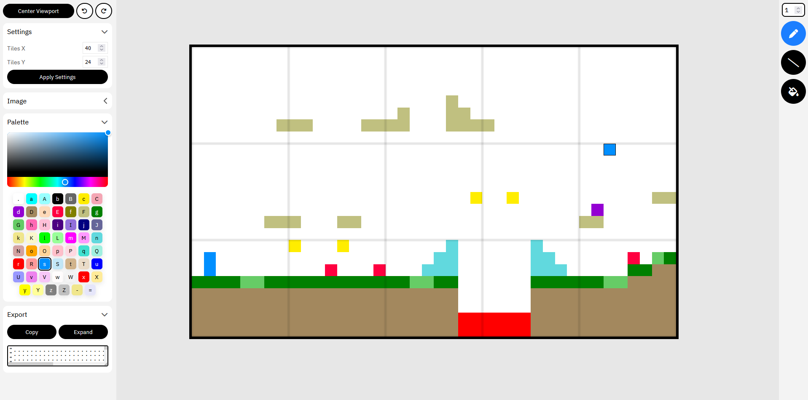

# Tile Map and Pixel Art Editor for p5play

This tool allows you to create pixel art and convert it into a format compatible with [p5play's](https://p5play.org/) Tile and Sprite functions. The editor is equipped with a variety of features to enhance your creative process.

## Features

- **Drawing Tools**: Choose from three different tools—Pen, Line, and Fill—to create your pixel art.
- **Undo/Redo**: Easily undo or redo your actions with the click of a button.
- **Image Upload**: Upload an image, and the editor will automatically convert it into pixel art format.
- **Download**: Save your creations by downloading them as PNG images, or copy the string in p5play format.
- **Color Palette**: Customize your colors using a color picker or select from a default palette.
- **Dynamic Canvas**: Set custom canvas dimensions to suit your needs.
- **Pixel Data Conversion**: Converts your pixel art into a format compatible with p5play Tile and Sprite functions.
- **Pan and Zoom**: Navigate your canvas easily with pan and zoom functionalities.

## Live Demo

You can access the live version of the Tile Map Editor [here](https://tezumie.github.io/p5play-Tile-Map-Editor/). 

Enjoy creating amazing pixel art and integrating it seamlessly with p5play!

## Contributing

If you'd like to contribute to the project, feel free to fork the repository and submit a pull request. Contributions are welcome!

## License

This project is released under the CC BY-NC license. See the LICENSE file for details.

## Support

To support this project, please consider [becoming a patron](https://www.patreon.com/aijscodeeditor).

## Contact

For any questions or feedback, please reach out on Discord or join our community: https://discord.com/invite/eW7MbvXZbY

